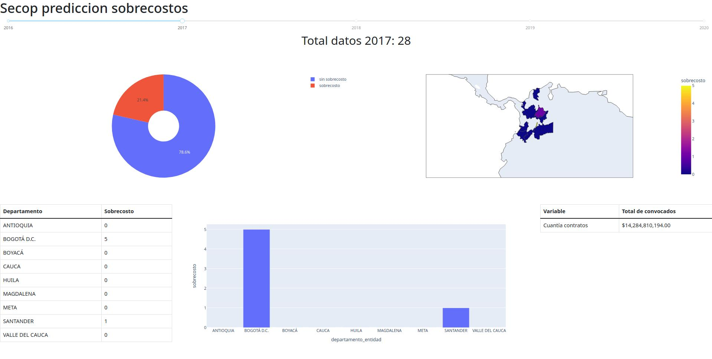

# Deployment

El dashboard representa la predicción sobre los proyectos convocados entre los años 2016 a 2020.

Para cada año se muestran la distribución porcentual de los proyectos que presentan sobrecostos y los que no. En donde el cliente puede:

* Explorar la información para cada año
* Identificar los departamentos mayor número de contratos con sobrecosto.
* Identificar visualmente en un mapa las regiones con mas proyectos con sobrecostos.
* Se muestra las cuantías totales de todos los proyectos referentes al año seleccionado.
  
