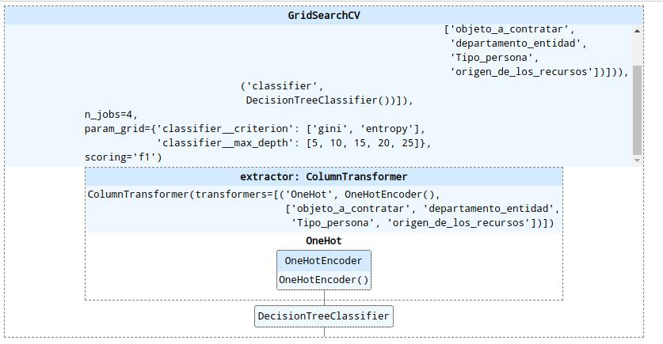

# Baseline Model Report

A continuación haremos una descripción de la fase de modelamiento de los datos.

## Analytic Approach
* Nuestra variable objetivo es el sobrecosto, la cual identifica con 1 los registros en donde el valor total de las adiciones sea superior al 20% de la cuantía del contrato o 0 en otro caso
* Nuestras variables predictoras son las siguientes:
	* Objeto a contratar: actividad economica del objetivo del contrato.
	* Departamento entidad: Departamento de la ejecución del contrato.
	* Tipo persona: Esta variable identifica si el contratista es una persona natural o jurídica.
	* Origen de los recursos: Identificador de la forma en que se consiguen los recursos con los que se va a pagar el contrato.
* Como los proyectos con sobrecosto eran menos del 10% del total de la base, decidimos hacer oversampling sobre la categoría con sobrecosto.
* Se construyeron modelos de regresión logística, árboles de decision, bosques aleatorios y una red neuronal multicapa. Elgiendo el modelo con mejor desempeño en este caso fue un árbol de decisión.

## Solution Description
* Simple solution architecture (Data sources, solution components, data flow)
  
* La variable de salida es si el contrato presentaría sobrecosto o no.

## Data
* Los datos se obtienen del portal datos abiertos que se encuentra en el siguiente [enlace](https://www.datos.gov.co/resource/xvdy-vvsk.json).
* En este caso ingresamos al modelo para entrenamiento una matriz dispersa con el total de registros 451262 y 102 variables después de realizar el OneHotEncoder.
  
* Debido al desbalanceo de las clases fue necesario hacer oversampling sobre la clase si dejando una proporcion del 70% para los proyectos que no tienen sobrecosto, y 30% para los que si.
* Para el entrenamiento del modelo se tuvo en cuentalos contratos que estuvieran liquidados ya que de esta manera podíamos saber si tenían sobrecosto o no. Y se tomó como ventana de análisis el periodo entre el 2016 y el 2019.
* 451262 registros se emplearon para el entrenamiento del modelo.

## Algorithm

  
-------
Para la eleccion del modelo se realiza una busqueda de hiperparámetros con las siguientes combinaciones.
  * max_depth : [5,10,15,20,25],
  * criterion : ['gini', 'entropy']
  * numero de pliegues: 5
  * scoring : F1
  
Empleando estos parámteros se consiguió el siguiente modelo.
  
  * criterio: 'gini'
  * max_depth: 25
  
  
## Features
A continuación se muestran las variables de entrada con sus respectivas categorías las cuales al realizar el OneHotEncoder terminan convertidas en variables para ingresar al modelo.
* Departamento entidad
   * HUILA
   * LA GUAJIRA
   * BOGOTÁ D.C.
   * TOLIMA
   * SANTANDER
   * CAUCA
   * ANTIOQUIA
   * BOYACÁ
   * CUNDINAMARCA
   * PUTUMAYO
   * ARAUCA
   * CAQUETÁ
   * NORTE DE SANTANDER
   * CESAR
   * CÓRDOBA
   * VALLE DEL CAUCA
   * NARIÑO
   * GUAVIARE
   * CALDAS
   * MAGDALENA
   * META
   * BOLÍVAR
   * CASANARE
   * VICHADA
   * SUCRE
   * RISARALDA
   * QUINDÍO
   * VAUPÉS
   * CHOCÓ
   * SAN ANDRÉS, PROVIDENCIA Y SANTA CATALINA
   * ATLÁNTICO
   * GUAINÍA
   * COLOMBIA
   * AMAZONAS
* Objeto a contratar
  * Instrumentos Musicales, Juegos, Artes, Artesanías y Equipo educativo, Materiales, Accesorios y Suministros
   * Servicios de Viajes, Alimentación, Alojamiento y Entretenimiento
   * Servicios Educativos y de Formación
   * Servicios de Salud
   * Servicios de Edificación, Construcción de Instalaciones y Mantenimiento
   * Equipos de Oficina, Accesorios y Suministros
   * Servicios de Transporte, Almacenaje y Correo
   * Servicios de Gestion, Servicios Profesionales de Empresa y Servicios Administrativos
   * Publicaciones Impresas, Publicaciones Electronicas y Accesorios
   * Componentes y Suministros Electrónicos
   * Servicios Públicos y Servicios Relacionados con el Sector Público
   * Servicios Financieros y de Seguros
   * Maquinaria, Accesorios y Suministros para Manejo, Acondicionamiento y Almacenamiento de Materiales
   * Equipos y Suministros para Limpieza
   * Servicios Políticos y de Asuntos Cívicos
   * Alimentos, Bebidas y Tabaco
   * Servicios Basados en Ingeniería, Investigación y Tecnología
   * Muebles, Mobiliario y Decoración
   * Servicios de Limpieza, Descontaminación y Tratamiento de Residuos
   * Material Vivo Vegetal y Animal, Accesorios y Suministros
   * Equipo Médico, Accesorios y Suministros
   * Terrenos, Edificios, Estructuras y Vías
   * Servicios Editoriales, de Diseño, de Artes Graficas y Bellas Artes
   * Componentes y Suministros de Manufactura
   * Componentes y Suministros para Estructuras, Edificación, Construcción y Obras Civiles
   * Servicios de Contratacion Agrícola, Pesquera, Forestal y de Fauna
   * Equipos, Suministros y Accesorios para Deportes y Recreación
   * Componentes y Equipos para Distribución y Sistemas de Acondicionamiento
   * Servicios Medioambientales
   * Difusión de Tecnologías de Información y Telecomunicaciones
   * Servicios de Defensa Nacional, Orden Publico, Seguridad y Vigilancia
   * Equipos y Suministros de Laboratorio, de Medición, de Observación y de Pruebas
   * Materiales Combustibles, Aditivos para Combustibles, Lubricantes y Anticorrosivos
   * Equipos y Suministros para Impresión, Fotografia y Audiovisuales
   * Herramientas y Maquinaria General
   * Materiales y Productos de Papel
   * Artículos Domésticos, Suministros y Productos Electrónicos de Consumo
   * Ropa, Maletas y Productos de Aseo Personal
   * Componentes, Accesorios y Suministros de Sistemas Eléctricos e Iluminación
   * Servicios de Producción Industrial y Manufactura
   * Organizaciones y Clubes
   * Medicamentos y Productos Farmacéuticos
   * Equipos y Suministros de Defensa, Orden Publico, Proteccion, Vigilancia y Seguridad
   * Vehículos Comerciales, Militares y Particulares, Accesorios y Componentes
   * Productos para Relojería, Joyería y Piedras Preciosas
   * Material Químico incluyendo Bioquímicos y Materiales de Gas
   * Servicios Personales y Domésticos
   * Maquinaria y Accesorios para Construcción y Edificación
   * Maquinaria y Accesorios para Agricultura, Pesca, Silvicultura y Fauna
   * Maquinaria, Equipo y Suministros para la Industria de Servicios
   * Maquinaria y Accesorios de Minería y Perforación de Pozos
   * Material Mineral, Textil y  Vegetal y Animal No Comestible
   * Maquinaria y Accesorios para Generación y Distribución de Energía
   * Maquinaria y Accesorios para Manufactura y Procesamiento Industrial
   * Materiales de Resina, Colofonia, Caucho, Espuma, Película y Elastómericos
   * Servicios de Minería, Petróleo y Gas
 * Tipo persona
   * Persona natural
   * Persona jurídica
 * Origen de los recursos
   * No Definido
   * Presupuesto General de la Nación – PGN
   * Recursos propios
   * Sistema General de Participaciones - SGP
   * Recursos en especie
   * Recursos Propios (Alcaldías, Gobernaciones y Resguardos Indígenas)
   * Otros recursos
   * Sistema General de Regalías - SGR
   * Recursos de crédito
   * Recursos privados/cooperación
   * Asignación Especial del Sistema General de Participación para Resguardos Indígenas - AESGPRI
  
Según el modelo entrenado las variables mas representativas se presentan en la siguiente tabla con su  respectiva importancia.

  |Nombre variable | Importancia |
|------|------|
| departamento_entidad_BOGOTÁ D.C. | 0.08278592624169565|
| origen_de_los_recursos_Sistema General de Participaciones - SGP | 0.0728548577390756|
| objeto_a_contratar Servicios Profesionales y Servicios Administrativos | 0.0641066582776165|
| objeto_a_contratar_Servicios de Salud | 0.06113741776455204|
| departamento_entidad_NARIÑO | 0.05042376981999864|
| objeto_a_contratar_Organizaciones y Clubes | 0.03990321975570361|
| departamento_entidad_BOYACÁ | 0.037643982947686255|
| departamento_entidad_SANTANDER | 0.03447794219039164|
| objeto_a_contratar_Servicios Políticos y de Asuntos Cívicos | 0.031153806736812607|
| origen_de_los_recursos_Recursos propios | 0.03101833189854336|

